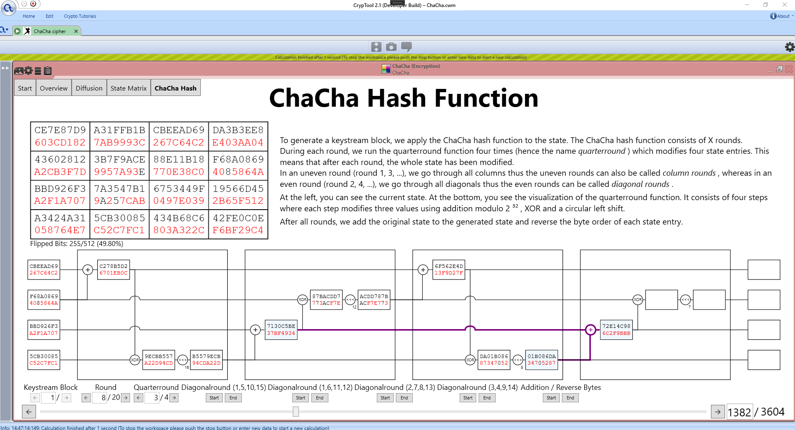

# ChaCha-CT2

ChaCha Cipher Visualization as a plugin for CrypTool 2. Bachelor thesis. (Thesis paper can be found [here](https://github.com/ekzyis/ChaCha-Thesis))

### How to build and run 
1. Download Codebase for [CrypTool 2](https://www.cryptool.org/de/cryptool2). Read the [documentation](https://www.cryptool.org/de/ct2-dokumentation) of CT2 for how to do this.
2. Clone this repository and move it into the `CrypPlugins` folder in the CT2 codebase.
3. Open the CT2 .SLN file with Visual Studio 2019.
4. Add the ChaCha project to `CrypPlugins` using the ChaCha .CSPPROJ file which is provided in this repository.
5. Build the whole solution.
6. Run solution.

### How to run tests

The ChaChaTest .CS file must be added to the `UnitTests` project of the CT2 Solution. Then you can just run the test using the the Test Explorer in Visual Studio. Make sure that you are in the Test configuration.
